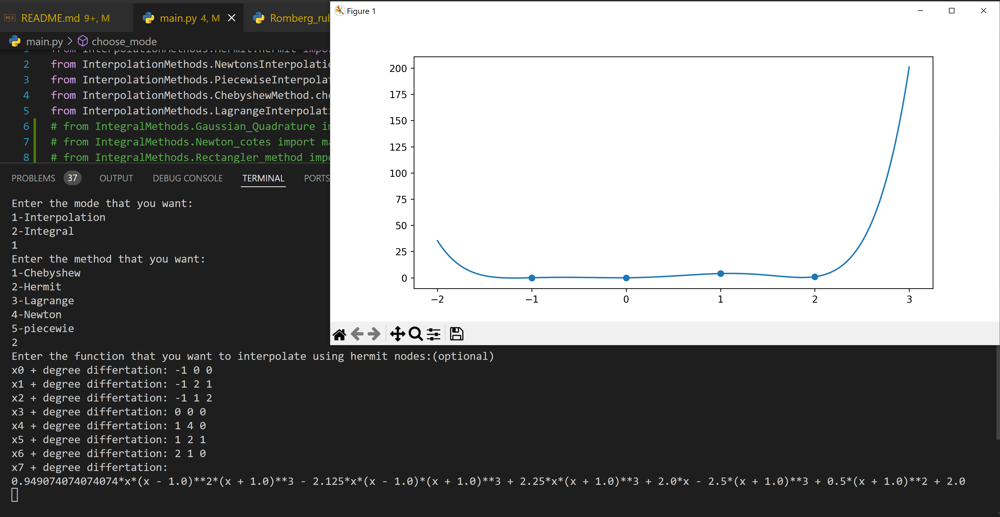
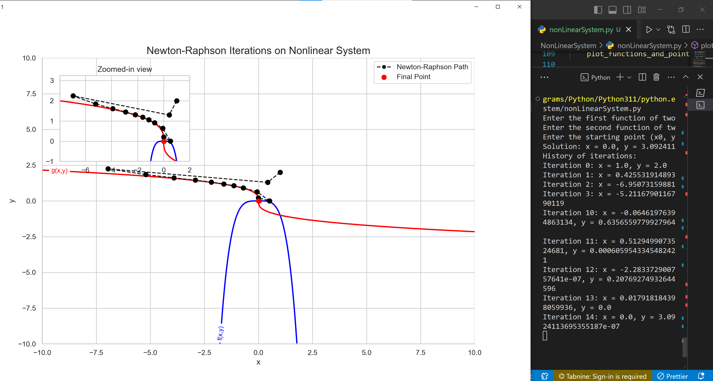

# Number Analysis
<div align="center">

</div>

## Intruduction
This repository encompasses a variety of numerical analysis techniques, including root finding, interpolation, regression, integration, and differentiation.

## Installation
at first install python and install the library in the `requirement.txt` file using this command
```
pip install -r requirements.txt
```
and then run the main file.
```
python main.py
```

## Methods:
### Root finding:
1. by section:
### Interpolation:
1. Chebyshew:
    
2. Hermit:
    
3. Lagrange:

4. Newton:

5. Piecewise:
### Integral:
1. Gaussian:
2. Newton_cotes:
3. Rectangle:
4. Romberg:
### Non linear systems:

## Contrbution:
Contributions are welcome! Please feel free to submit a pull request.